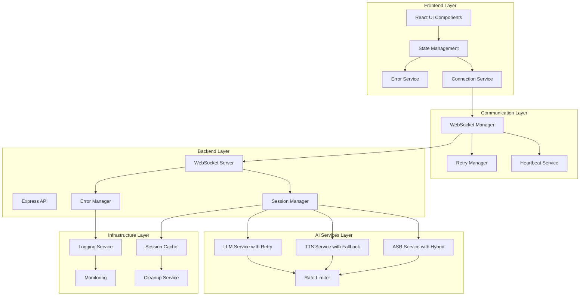
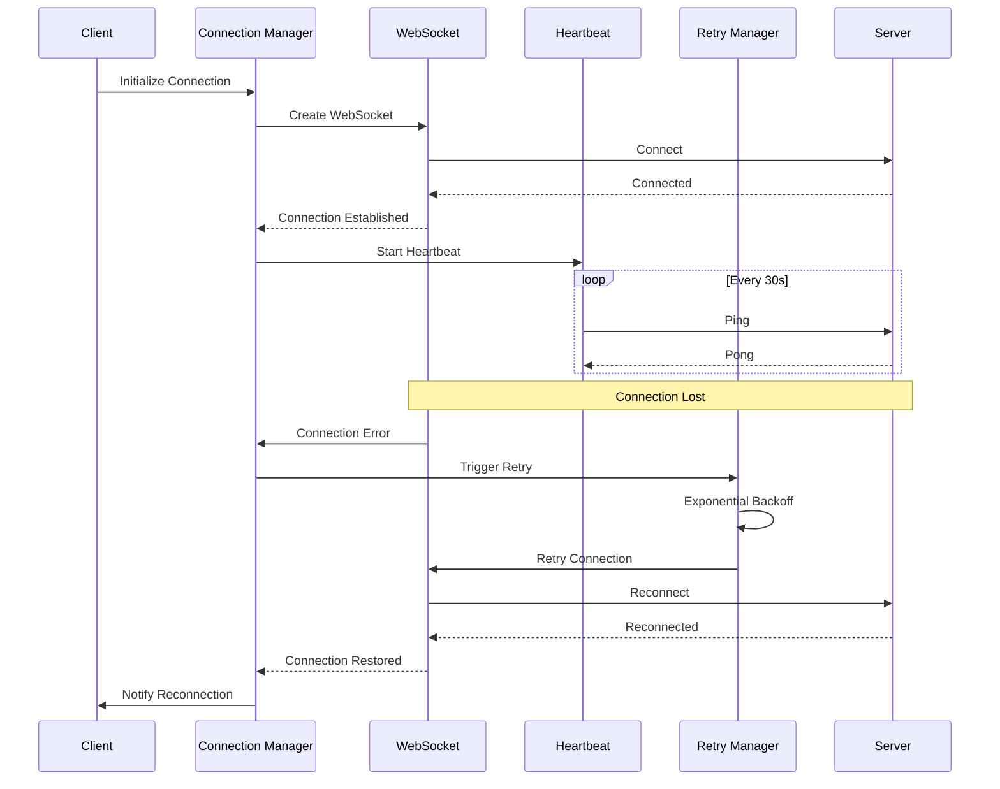

# Design Document

## Overview

Данный дизайн-документ описывает архитектурные решения и технические подходы для исправления критических ошибок в Voice AI RPG Game. Основная цель - создать стабильную, надежную систему с правильной обработкой ошибок, эффективным управлением ресурсами и улучшенным пользовательским опытом.

## Architecture

### High-Level Architecture



### Connection Reliability Architecture



## Components and Interfaces

### 1. Enhanced Error Handling System

#### ErrorManager Interface
```typescript
interface ErrorManager {
  handleError(error: AppError): void;
  registerErrorHandler(type: ErrorType, handler: ErrorHandler): void;
  getErrorState(): ErrorState;
  clearError(type: ErrorType): void;
  createRecoveryPlan(error: AppError): RecoveryPlan;
}

interface AppError {
  type: ErrorType;
  severity: 'low' | 'medium' | 'high' | 'critical';
  message: string;
  context: Record<string, any>;
  timestamp: Date;
  recoverable: boolean;
  retryable: boolean;
}

interface RecoveryPlan {
  steps: RecoveryStep[];
  autoExecute: boolean;
  userAction?: string;
}
```

#### Implementation Strategy
- **Centralized Error Handling**: Единая система обработки ошибок для всего приложения
- **Error Classification**: Классификация ошибок по типу и серьезности
- **Recovery Strategies**: Автоматические стратегии восстановления для каждого типа ошибок
- **User Feedback**: Понятные сообщения пользователю с инструкциями по решению

### 2. Robust Connection Management

#### ConnectionManager Interface
```typescript
interface ConnectionManager {
  connect(): Promise<void>;
  disconnect(): void;
  getConnectionState(): ConnectionState;
  onStateChange(callback: (state: ConnectionState) => void): void;
  sendMessage(message: any): Promise<void>;
  enableHeartbeat(interval: number): void;
}

interface ConnectionState {
  status: 'connecting' | 'connected' | 'disconnected' | 'reconnecting' | 'failed';
  lastConnected?: Date;
  reconnectAttempts: number;
  latency?: number;
}
```

#### Implementation Strategy
- **Automatic Reconnection**: Экспоненциальный backoff для переподключения
- **Heartbeat Monitoring**: Регулярная проверка состояния соединения
- **Connection Pooling**: Управление множественными соединениями
- **Graceful Degradation**: Работа в offline режиме при необходимости

### 3. AI Services with Rate Limiting and Retry Logic

#### Enhanced LLM Service
```typescript
interface EnhancedLLMService {
  generateResponse(prompt: string, context: GameContext): Promise<string>;
  getServiceHealth(): ServiceHealth;
  configureRetry(config: RetryConfig): void;
  enableRateLimit(config: RateLimitConfig): void;
}

interface RetryConfig {
  maxAttempts: number;
  baseDelay: number;
  maxDelay: number;
  backoffMultiplier: number;
  retryableErrors: string[];
}

interface RateLimitConfig {
  requestsPerMinute: number;
  burstLimit: number;
  queueSize: number;
}
```

#### Implementation Strategy
- **Rate Limiting**: Интеллектуальное управление запросами к OpenAI API
- **Circuit Breaker**: Защита от каскадных сбоев
- **Request Queuing**: Очередь запросов при превышении лимитов
- **Fallback Responses**: Заготовленные ответы при недоступности API

### 4. Hybrid Voice Processing System

#### Enhanced ASR Service
```typescript
interface EnhancedASRService {
  transcribeAudio(audio: Blob): Promise<TranscriptionResult>;
  startContinuousRecognition(): Promise<void>;
  stopContinuousRecognition(): Promise<string>;
  getAvailableMethods(): ASRMethods;
  switchMethod(method: ASRMethod): void;
}

interface TranscriptionResult {
  text: string;
  confidence: number;
  method: 'webspeech' | 'whisper';
  processingTime: number;
  alternatives?: string[];
}
```

#### Implementation Strategy
- **Method Fallback**: Автоматическое переключение между Web Speech API и Whisper
- **Quality Assessment**: Оценка качества распознавания и выбор лучшего метода
- **Audio Preprocessing**: Улучшение качества аудио перед обработкой
- **Continuous Recognition**: Поддержка непрерывного распознавания речи

### 5. Improved Session Management

#### SessionManager Interface
```typescript
interface EnhancedSessionManager {
  createSession(userId: string, story: Story): Promise<GameSession>;
  getSession(sessionId: string): Promise<GameSession | null>;
  updateSession(sessionId: string, updates: Partial<GameSession>): Promise<void>;
  pauseSession(sessionId: string): Promise<void>;
  resumeSession(sessionId: string): Promise<void>;
  cleanupSessions(maxAge: number): Promise<number>;
  getSessionMetrics(): SessionMetrics;
}

interface SessionMetrics {
  activeSessions: number;
  totalSessions: number;
  averageSessionDuration: number;
  memoryUsage: number;
}
```

#### Implementation Strategy
- **Memory Management**: Эффективное управление памятью для долгоживущих сессий
- **Session Persistence**: Сохранение состояния сессий при перезапуске
- **Automatic Cleanup**: Регулярная очистка неактивных сессий
- **Session Analytics**: Метрики для мониторинга производительности

## Data Models

### Enhanced Error Model
```typescript
interface ErrorLog {
  id: string;
  timestamp: Date;
  level: 'debug' | 'info' | 'warn' | 'error' | 'fatal';
  service: string;
  component: string;
  message: string;
  error?: Error;
  context: Record<string, any>;
  userId?: string;
  sessionId?: string;
  requestId?: string;
  stack?: string;
}
```

### Connection Health Model
```typescript
interface ConnectionHealth {
  isConnected: boolean;
  lastPing: Date;
  latency: number;
  reconnectCount: number;
  errorCount: number;
  uptime: number;
  quality: 'excellent' | 'good' | 'poor' | 'critical';
}
```

### Service Status Model
```typescript
interface ServiceStatus {
  name: string;
  status: 'healthy' | 'degraded' | 'unhealthy' | 'unknown';
  lastCheck: Date;
  responseTime: number;
  errorRate: number;
  availability: number;
  dependencies: ServiceDependency[];
}
```

## Error Handling

### Error Classification System

#### Error Types and Handling Strategies

1. **Connection Errors**
   - **Strategy**: Automatic retry with exponential backoff
   - **User Feedback**: "Подключение к серверу..." с прогресс-баром
   - **Recovery**: Переподключение в фоновом режиме

2. **API Rate Limit Errors**
   - **Strategy**: Queue requests and implement backoff
   - **User Feedback**: "Сервер перегружен, ожидайте..."
   - **Recovery**: Автоматическое повторение через интервал

3. **Authentication Errors**
   - **Strategy**: Clear invalid tokens and redirect
   - **User Feedback**: "Ошибка авторизации, обновите страницу"
   - **Recovery**: Обновление токенов или переавторизация

4. **Voice Processing Errors**
   - **Strategy**: Fallback to alternative method
   - **User Feedback**: "Переключение на резервный метод..."
   - **Recovery**: Автоматическое переключение ASR/TTS методов

### Error Recovery Patterns

```typescript
class ErrorRecoveryManager {
  private recoveryStrategies: Map<ErrorType, RecoveryStrategy>;
  
  async executeRecovery(error: AppError): Promise<RecoveryResult> {
    const strategy = this.recoveryStrategies.get(error.type);
    if (!strategy) {
      return { success: false, message: 'No recovery strategy found' };
    }
    
    try {
      await strategy.execute(error);
      return { success: true, message: 'Recovery successful' };
    } catch (recoveryError) {
      return { 
        success: false, 
        message: 'Recovery failed',
        fallbackRequired: true 
      };
    }
  }
}
```

## Testing Strategy

### Test Architecture Improvements

#### 1. Mock Strategy Redesign
```typescript
// Improved mock setup for consistent testing
class TestMockManager {
  setupWebSpeechAPI(): void {
    Object.defineProperty(window, 'SpeechRecognition', {
      writable: true,
      value: MockSpeechRecognition
    });
  }
  
  setupMediaRecorder(): void {
    Object.defineProperty(window, 'MediaRecorder', {
      writable: true,
      value: MockMediaRecorder
    });
  }
  
  cleanup(): void {
    // Proper cleanup of mocks
  }
}
```

#### 2. Integration Test Framework
```typescript
class IntegrationTestSuite {
  async testFullVoiceFlow(): Promise<void> {
    // Test complete voice input -> LLM -> TTS flow
    const audioInput = this.createMockAudio();
    const result = await this.voiceService.processVoiceInput(audioInput);
    expect(result.transcription).toBeDefined();
    expect(result.aiResponse).toBeDefined();
    expect(result.audioOutput).toBeDefined();
  }
}
```

#### 3. Performance Testing
```typescript
class PerformanceTestSuite {
  async testResponseTimes(): Promise<void> {
    const startTime = Date.now();
    await this.llmService.generateResponse('test prompt', mockContext);
    const responseTime = Date.now() - startTime;
    expect(responseTime).toBeLessThan(10000); // 10 second limit
  }
}
```

### Test Reliability Improvements

1. **Deterministic Mocks**: Предсказуемое поведение mock объектов
2. **Proper Cleanup**: Корректная очистка ресурсов после тестов
3. **Timeout Management**: Правильная настройка таймаутов для async операций
4. **Error Simulation**: Тестирование различных сценариев ошибок

## Performance Optimizations

### 1. Request Optimization
- **Request Batching**: Группировка множественных запросов
- **Response Caching**: Кэширование часто используемых ответов
- **Compression**: Сжатие данных для передачи
- **Connection Pooling**: Переиспользование соединений

### 2. Memory Management
- **Session Cleanup**: Автоматическая очистка старых сессий
- **Memory Monitoring**: Отслеживание использования памяти
- **Garbage Collection**: Оптимизация сборки мусора
- **Resource Pooling**: Переиспользование ресурсов

### 3. Audio Processing Optimization
- **Audio Compression**: Сжатие аудио данных перед отправкой
- **Streaming Processing**: Потоковая обработка аудио
- **Format Optimization**: Выбор оптимального аудио формата
- **Buffer Management**: Эффективное управление аудио буферами

## Monitoring and Logging

### Logging Architecture
```typescript
interface Logger {
  debug(message: string, context?: any): void;
  info(message: string, context?: any): void;
  warn(message: string, context?: any): void;
  error(message: string, error?: Error, context?: any): void;
  fatal(message: string, error?: Error, context?: any): void;
}

class StructuredLogger implements Logger {
  private formatLog(level: string, message: string, context?: any): LogEntry {
    return {
      timestamp: new Date().toISOString(),
      level,
      message,
      context,
      service: 'voice-ai-rpg',
      version: process.env.APP_VERSION,
      requestId: this.getCurrentRequestId()
    };
  }
}
```

### Monitoring Metrics
1. **Performance Metrics**
   - Response times for each service
   - Memory usage trends
   - CPU utilization
   - Network latency

2. **Business Metrics**
   - Active user sessions
   - Message processing rate
   - Error rates by component
   - Feature usage statistics

3. **Health Checks**
   - Service availability
   - Database connectivity
   - External API status
   - Resource utilization

## Security Considerations

### 1. API Security
- **Rate Limiting**: Защита от DDoS атак
- **Input Validation**: Валидация всех входящих данных
- **Authentication**: Проверка подлинности пользователей
- **Authorization**: Контроль доступа к ресурсам

### 2. Data Protection
- **Encryption**: Шифрование чувствительных данных
- **Sanitization**: Очистка пользовательского ввода
- **Audit Logging**: Логирование всех важных действий
- **Privacy**: Соблюдение требований конфиденциальности

## Deployment Strategy

### 1. Environment Configuration
- **Development**: Локальная разработка с hot reload
- **Testing**: Автоматизированное тестирование
- **Staging**: Предпродакшн среда для финального тестирования
- **Production**: Продакшн среда с мониторингом

### 2. Rollback Strategy
- **Version Control**: Контроль версий для быстрого отката
- **Database Migrations**: Обратимые миграции БД
- **Feature Flags**: Возможность отключения новых функций
- **Health Monitoring**: Автоматическое обнаружение проблем

## Migration Plan

### Phase 1: Critical Bug Fixes (Week 1)
1. Fix WebSocket connection issues
2. Implement proper error handling
3. Fix failing tests
4. Add rate limiting for OpenAI API

### Phase 2: Stability Improvements (Week 2)
1. Enhance session management
2. Improve voice processing reliability
3. Add comprehensive logging
4. Implement monitoring

### Phase 3: Performance Optimization (Week 3)
1. Optimize API response times
2. Implement caching strategies
3. Add performance monitoring
4. Optimize memory usage

### Phase 4: Testing and Documentation (Week 4)
1. Complete test coverage
2. Performance testing
3. Documentation updates
4. Deployment preparation