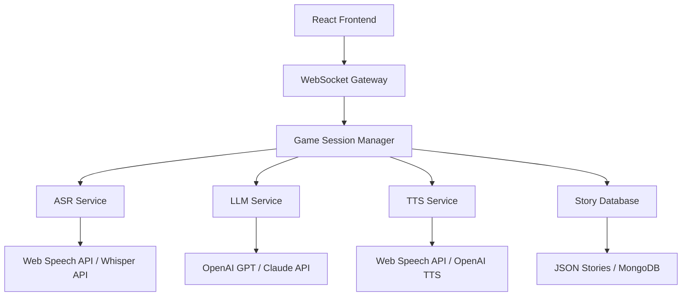

# Дизайн документ

## Обзор

Voice AI RPG игра построена как веб-приложение с React frontend и Node.js backend. Архитектура использует микросервисный подход для обработки различных AI сервисов (ASR, LLM, TTS) и обеспечивает real-time взаимодействие через WebSocket соединения.

## Архитектура

### Высокоуровневая архитектура



### Технологический стек

**Frontend:**
- React 18 с TypeScript
- Zustand для state management
- Socket.io-client для WebSocket
- Web Audio API для аудио обработки
- Tailwind CSS для стилизации

**Backend:**
- Node.js с Express
- Socket.io для WebSocket сервера
- TypeScript для типизации
- Axios для HTTP запросов к AI сервисам

**AI Сервисы:**
- ASR: Web Speech API (primary) + OpenAI Whisper (fallback)
- LLM: OpenAI GPT-4 или Claude-3
- TTS: Web Speech API (primary) + OpenAI TTS (premium)

## Компоненты и интерфейсы

### Frontend компоненты

#### 1. App Component
```typescript
interface AppProps {}
interface AppState {
  currentStory: Story | null;
  gameSession: GameSession | null;
  isConnected: boolean;
}
```

#### 2. StorySelector Component
```typescript
interface StorySelectorProps {
  stories: Story[];
  onStorySelect: (story: Story) => void;
}

interface Story {
  id: string;
  title: string;
  description: string;
  genre: string;
  initialPrompt: string;
  characterContext: string;
}
```

#### 3. ChatInterface Component
```typescript
interface ChatInterfaceProps {
  messages: Message[];
  onSendMessage: (message: string) => void;
  isLoading: boolean;
}

interface Message {
  id: string;
  type: 'user' | 'ai';
  content: string;
  timestamp: Date;
  audioUrl?: string;
}
```

#### 4. VoiceInput Component
```typescript
interface VoiceInputProps {
  onVoiceInput: (text: string) => void;
  isRecording: boolean;
  onRecordingStateChange: (recording: boolean) => void;
}
```

#### 5. AudioPlayer Component
```typescript
interface AudioPlayerProps {
  audioUrl: string;
  autoPlay: boolean;
  onPlaybackComplete: () => void;
}
```

#### 6. SettingsPanel Component
```typescript
interface SettingsPanelProps {
  settings: AudioSettings;
  onSettingsChange: (settings: AudioSettings) => void;
}

interface AudioSettings {
  ttsEnabled: boolean;
  ttsVolume: number;
  asrSensitivity: number;
  voiceSpeed: number;
}
```

### Backend сервисы

#### 1. WebSocket Gateway
```typescript
interface SocketEvents {
  'join-game': (storyId: string) => void;
  'send-message': (message: string) => void;
  'voice-input': (audioBlob: Blob) => void;
  'game-response': (response: GameResponse) => void;
  'error': (error: ErrorResponse) => void;
}
```

#### 2. Game Session Manager
```typescript
interface GameSession {
  id: string;
  storyId: string;
  userId: string;
  messages: Message[];
  context: GameContext;
  createdAt: Date;
}

interface GameContext {
  story: Story;
  characterState: Record<string, any>;
  gameState: Record<string, any>;
}
```

#### 3. ASR Service
```typescript
interface ASRService {
  transcribeAudio(audioBlob: Blob): Promise<string>;
  isAvailable(): boolean;
}

class WebSpeechASR implements ASRService {
  transcribeAudio(audioBlob: Blob): Promise<string>;
  isAvailable(): boolean;
}

class WhisperASR implements ASRService {
  transcribeAudio(audioBlob: Blob): Promise<string>;
  isAvailable(): boolean;
}
```

#### 4. LLM Service
```typescript
interface LLMService {
  generateResponse(prompt: string, context: GameContext): Promise<string>;
}

class OpenAILLM implements LLMService {
  generateResponse(prompt: string, context: GameContext): Promise<string>;
}
```

#### 5. TTS Service
```typescript
interface TTSService {
  synthesizeSpeech(text: string, options: TTSOptions): Promise<string>;
}

interface TTSOptions {
  voice: string;
  speed: number;
  pitch: number;
}

class WebSpeechTTS implements TTSService {
  synthesizeSpeech(text: string, options: TTSOptions): Promise<string>;
}

class OpenAITTS implements TTSService {
  synthesizeSpeech(text: string, options: TTSOptions): Promise<string>;
}
```

## Модели данных

### Story Model
```typescript
interface Story {
  id: string;
  title: string;
  description: string;
  genre: 'fantasy' | 'sci-fi' | 'mystery' | 'adventure' | 'horror';
  initialPrompt: string;
  characterContext: string;
  gameRules: string[];
  createdAt: Date;
  updatedAt: Date;
}
```

### Message Model
```typescript
interface Message {
  id: string;
  sessionId: string;
  type: 'user' | 'ai';
  content: string;
  audioUrl?: string;
  metadata: {
    processingTime?: number;
    confidence?: number;
    tokens?: number;
  };
  timestamp: Date;
}
```

### GameSession Model
```typescript
interface GameSession {
  id: string;
  storyId: string;
  userId: string;
  status: 'active' | 'paused' | 'completed';
  messages: Message[];
  context: {
    story: Story;
    characterState: Record<string, any>;
    gameState: Record<string, any>;
    conversationHistory: string[];
  };
  settings: AudioSettings;
  createdAt: Date;
  updatedAt: Date;
}
```

## Обработка ошибок

### Frontend Error Handling
```typescript
interface ErrorState {
  asrError: string | null;
  llmError: string | null;
  ttsError: string | null;
  connectionError: string | null;
}

class ErrorHandler {
  handleASRError(error: Error): void;
  handleLLMError(error: Error): void;
  handleTTSError(error: Error): void;
  handleConnectionError(error: Error): void;
}
```

### Backend Error Handling
```typescript
interface ErrorResponse {
  type: 'ASR_ERROR' | 'LLM_ERROR' | 'TTS_ERROR' | 'VALIDATION_ERROR';
  message: string;
  details?: any;
  timestamp: Date;
}

class GameErrorHandler {
  handleServiceError(service: string, error: Error): ErrorResponse;
  logError(error: ErrorResponse): void;
}
```

## Стратегия тестирования

### Unit Tests
- Компоненты React (Jest + React Testing Library)
- Сервисы backend (Jest + Supertest)
- AI сервисы с mock данными
- Утилиты и хелперы

### Integration Tests
- WebSocket соединения
- AI сервисы интеграция
- Audio pipeline (ASR → LLM → TTS)
- Database операции

### E2E Tests
- Полный игровой flow (Playwright)
- Voice input/output pipeline
- Story selection и game session
- Error scenarios

### Performance Tests
- Audio latency измерения
- LLM response time
- WebSocket throughput
- Memory usage при длинных сессиях

## Безопасность

### API Security
- Rate limiting для AI сервисов
- Input validation и sanitization
- API ключи в environment variables
- CORS настройки

### Audio Security
- Валидация audio файлов
- Ограничения на размер и длительность
- Secure audio storage (temporary)

### Data Privacy
- Минимальное хранение пользовательских данных
- Автоматическое удаление старых сессий
- Опциональная анонимизация

## Производительность

### Frontend Optimization
- Lazy loading компонентов
- Audio streaming для больших файлов
- Debouncing для voice input
- Memoization для expensive operations

### Backend Optimization
- Connection pooling для AI APIs
- Caching для story data
- Audio compression
- WebSocket connection management

### AI Services Optimization
- Streaming responses от LLM
- Batch processing для TTS
- Fallback механизмы для ASR
- Response caching где возможно